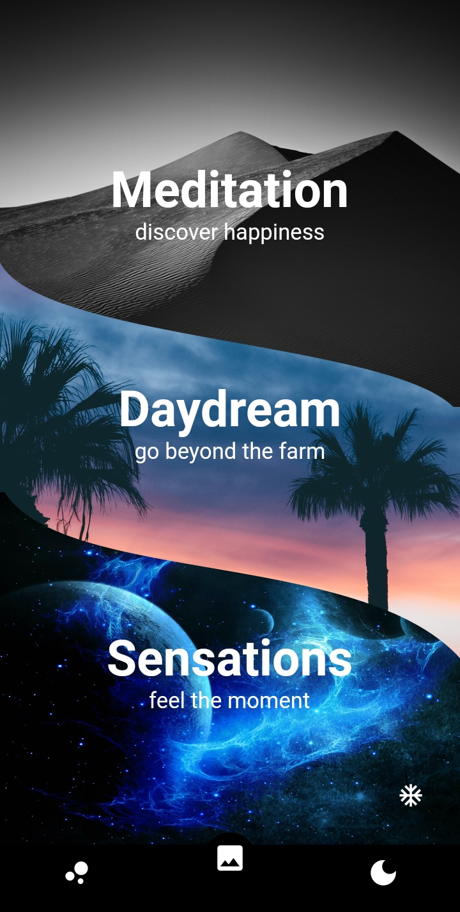
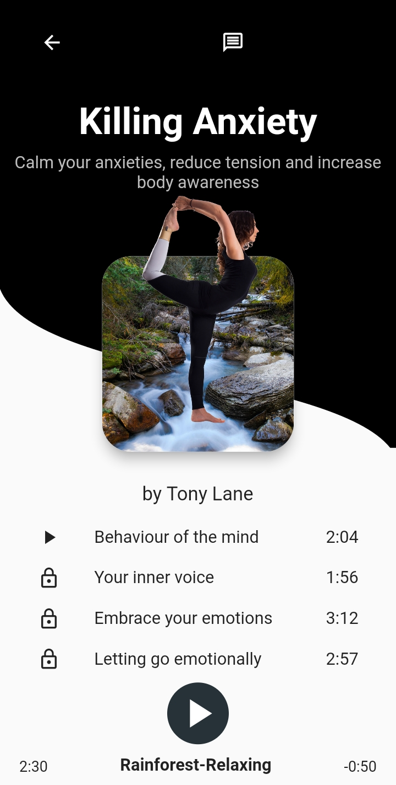
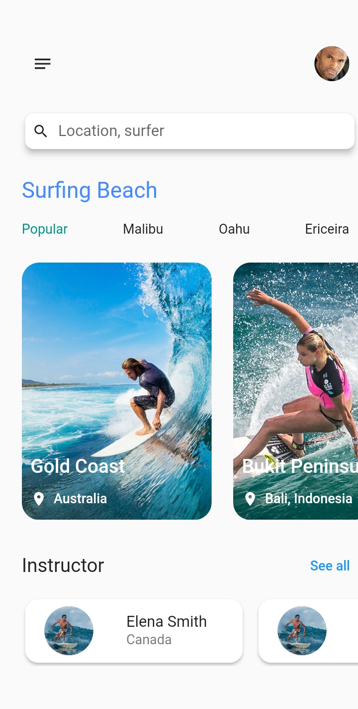
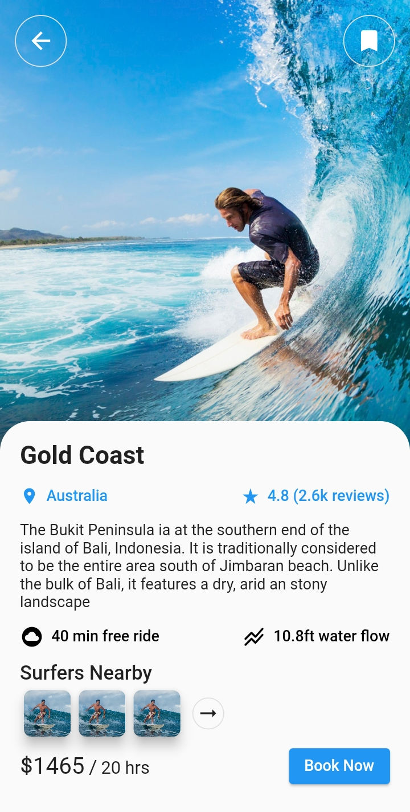
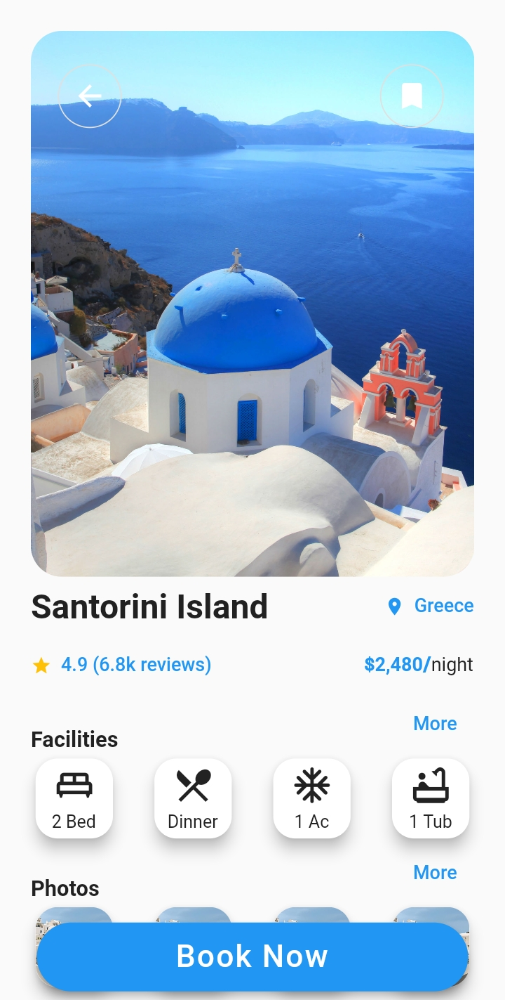

### Hi there 👋, my name is O'neya
#### I am flutter/dart platform developer and HTML/CSS/JS web developer
I have always been fascinated with the advancement in technology ever since I was a child. Being able to contribute in my big way to further this advancement is a path in my life's purpose 

- 🔭 I’m currently working on a series of flutter UIs
- 🌱 I’m currently learning FlutterFire
- 👯 I’m looking to collaborate on Flutter project
- 💬 Ask me about Flutter layouts (ClipPaths/Positioning etc)
- 📫 How to reach me: freddyoneya4@gmail.com
- ⚡ Fun fact: I would like to work in MAANGs someday

Skills: FLUTTER / DART / HTML / CSS/ JS

### UI Examples

  

  
 

       
